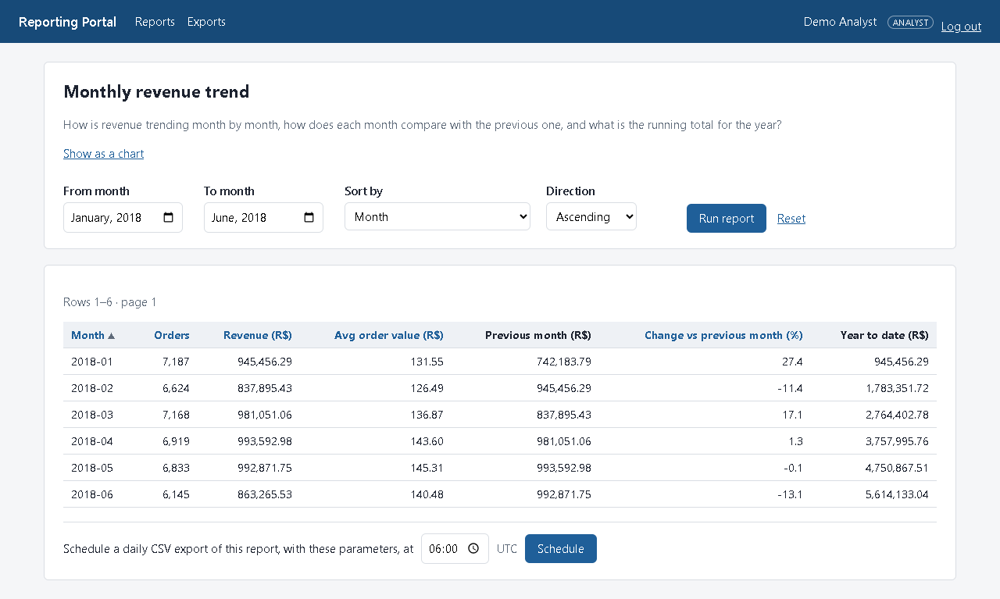
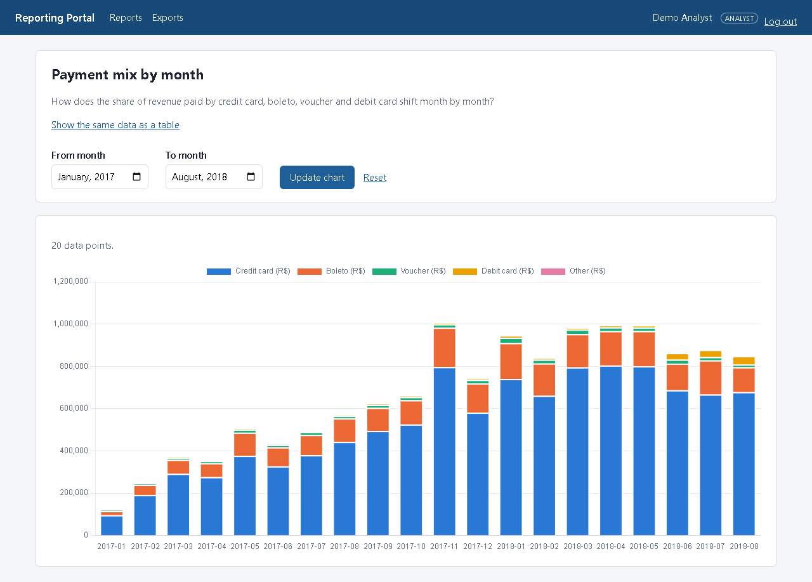
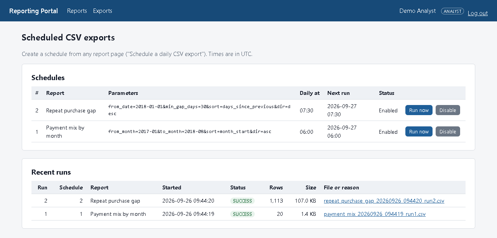
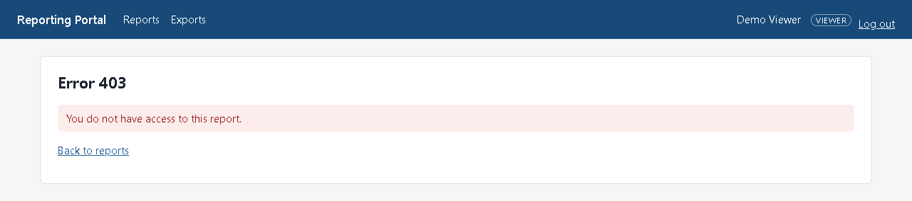

# Reporting Portal (Java 17 · Servlets/JSP/JSTL · JDBC · Oracle · Tomcat 10.1)

A J2EE web application for the reports of the companion **retail-warehouse** project (Oracle 21c XE star schema, Olist e-commerce data: ~100K orders, 112K+ order line items, 2016–2018). The two repositories are expected side by side, with the warehouse checked out as `../retail`.

- **12 reports**, one per warehouse view, each with a parameter form (date or month ranges, state, category, top-N, …). The values are validated on the server and applied through bound `PreparedStatement` parameters. Sorting, paging and column choice go through per-report whitelists.
- **Role-based access**: three roles (viewer, analyst, admin). Each report is assigned to the roles allowed to see it, and this is checked on the server for every page, chart, JSON endpoint, schedule and download, not only in the menu.
- **Charts**: three reports have Chart.js pages (line, horizontal bar, stacked bar), fed by a JSON endpoint with the same checks as the HTML pages.
- **Scheduled CSV exports**: schedule any report with its parameters for a daily time. A background scheduler inside the web app writes the file and records every run. Users list and download their past exports.
- **Security**:
  - a session-based login with BCrypt passwords and session-fixation protection;
  - `HttpOnly`/`Secure`/`SameSite` cookies;
  - CSRF tokens on every POST;
  - `<c:out>` escaping in every JSP, and a Content-Security-Policy;
  - report queries run as the warehouse's **read-only** reporting user.

No framework: plain Jakarta Servlets, JSP with JSTL, JDBC and HikariCP, built with Maven and run on Tomcat 10.1. Everything runs in Docker. The design, and every decision behind it, is in [DESIGN.md](DESIGN.md).

## Architecture

```
 Browser  (HTML forms, vanilla JS, Chart.js 4 from cdn.jsdelivr.net)
    │  HTTP, 127.0.0.1:8080 only
    ▼
┌──────────────── container reporting-portal-portal-1: Tomcat 10.1 on JDK 17 ─────────────────┐
│  Filters (in web.xml order): SecurityHeadersFilter ─► AuthFilter ─► CsrfFilter              │
│  Servlets: Login · Logout · Health · ReportList · Report · ChartPage · ReportData (JSON)     │
│            Export · ExportDownload                ─forward─►  JSPs in /WEB-INF/jsp (JSTL)   │
│  Model:    ReportRegistry · ParamValidator · ReportQuery · AccessPolicy · DAOs · CsvWriter  │
│  ExportScheduler: 1 background thread, every 30 s ── writes CSV ──► /exports ─► ./exports    │
│  HikariCP pools:  "portal" (2) logins, schedules, runs  ·  "warehouse" (5) report queries   │
└────────┬──────────────────────────────────────┬─────────────────────────────────────────────┘
         │ as PORTAL                            │ as dw_report (read-only)
         ▼                                      ▼
┌──────────── Oracle 21c XE (container retail-oracle-1, from ../retail), PDB XEPDB1 ──────────┐
│  schema PORTAL: users, roles, user_roles, reports, report_roles, export_schedules,          │
│                 export_runs                                                                  │
│  schema DW:     star schema + 12 report views v_rpt_*  (dw_report may SELECT the views only) │
└─────────────────────────────────────────────────────────────────────────────────────────────┘
```

## Run it in 5 commands

**Before you start:**
- Docker Desktop is running.
- The warehouse is up and loaded. In `../retail`, follow its README: `./bin/up.sh`, then its install and load commands.
- On Windows, run the commands from Git Bash.
- Nothing else needs to be installed: Maven, the JDK and Tomcat all run in containers.

```bash
cp .env.example .env              # 1. set PORTAL_DB_PASSWORD, and copy REPORT_USER / REPORT_PASSWORD
                                  #    from ../retail/.env into WAREHOUSE_DB_USER / WAREHOUSE_DB_PASSWORD
bin/db-setup.sh                   # 2. create the portal's own schema, tables and the three demo users
docker compose up -d --build      # 3. build (compiles and runs the 67 unit tests) and start Tomcat
tests/smoke.sh                    # 4. optional: 36 end-to-end checks against the running portal
start http://localhost:8080       # 5. open the portal (macOS: open, Linux: xdg-open) and log in
```

Other commands:

```bash
bin/mvn.sh test                   # unit tests only, in a Maven container
curl http://localhost:8080/health # UP / DOWN, and whether the warehouse views are readable
docker compose logs -f portal     # Tomcat log (logins, access denials, report timings, export runs)
docker compose down               # stop (the portal's data stays in the warehouse database)
bin/db-setup.sh --reset           # drop and recreate the portal schema (users, schedules, runs)
bin/hash-password.sh              # BCrypt hash for a new password, e.g. to change a demo login
```

## Logins

These are demo users, created by `db/02_seed.sql`. Only their BCrypt hashes are stored; change them on any shared machine.

| Username | Password | Role | Sees |
|---|---|---|---|
| `viewer` | `Viewer#2026` | VIEWER | 4 company-level summary reports |
| `analyst` | `Analyst#2026` | ANALYST | 11 reports: everything except customer address history |
| `admin` | `Admin#2026` | ADMIN | all 12 reports, and every user's export schedules and runs |

## The reports

Every report also accepts `sort` and `dir` (checked against the report's sort whitelist) and `page` (50 rows per page), except `category_quarters`: it is ordered by the chosen quarter and shows at most 50 rows.

| Report | Warehouse view | Roles | Parameters | Chart |
|---|---|---|---|---|
| `monthly_revenue`: Monthly revenue trend | `v_rpt_monthly_revenue` | viewer, analyst, admin | from month, to month | line: revenue by month |
| `revenue_grouping_sets`: Revenue by year and payment type | `v_rpt_revenue_grouping_sets` | viewer, analyst, admin | breakdown (YEAR / PAYMENT TYPE / TOTAL) | |
| `weekday_orders`: Orders by weekday, 2017 vs 2018 | `v_rpt_weekday_orders_pivot` | viewer, analyst, admin | sort only (7 rows) | |
| `late_delivery`: Late deliveries by state and year | `v_rpt_late_delivery_cube` | viewer, analyst, admin | customer state, order year, hide subtotals | |
| `payment_mix`: Payment mix by month | `v_rpt_payment_mix_monthly` | analyst, admin | from month, to month | stacked bar: 5 payment types |
| `revenue_state_category`: Revenue by state and category | `v_rpt_revenue_state_category` | analyst, admin | customer state, category, hide subtotals | |
| `top_categories_by_state`: Top categories in each state | `v_rpt_top_categories_by_state` | analyst, admin | customer state, top N (1–3) | |
| `seller_rank`: Leading sellers in each state | `v_rpt_seller_rank_in_state` | analyst, admin | seller state, top N (1–10) | |
| `category_quarters`: Top categories by quarter | `v_rpt_category_quarter_pivot` | analyst, admin | category, quarter (column whitelist), top N (1–50) | horizontal bar: top N in the chosen quarter |
| `cohort_retention`: Customer cohort retention | `v_rpt_cohort_retention` | analyst, admin | from cohort month, to cohort month, months since first purchase (0–25) | |
| `repeat_purchase_gap`: Repeat purchase gap | `v_rpt_repeat_purchase_gap` | analyst, admin | order date from, to, minimum days since previous order (0–1000) | |
| `customer_moves`: Customer address changes (SCD2) | `v_rpt_customer_moves` | admin | moved-to state, only moves to another state | |

URLs:
- `/reports/{code}`: the form and table.
- `/charts/{code}`: the chart page.
- `/api/reports/{code}`: the same data as JSON.

Why some reports have no date range: views such as state × category already sum over all dates, so the portal can filter their rows but cannot re-aggregate them by date (DESIGN.md, section e).

## Screenshots









## How it is built

| Concern | Where |
|---|---|
| Pools, registry and scheduler start and stop with the web app | `config/AppContextListener` |
| Login, session fixation, BCrypt | `auth/LoginServlet`, `auth/PasswordHasher` |
| No page without a session; CSRF on every POST; CSP and other headers | `auth/AuthFilter`, `auth/CsrfFilter`, `auth/SecurityHeadersFilter` (order set in `web.xml`) |
| Report definitions (view, columns, parameters, SQL fragments, sort whitelist) | `report/ReportRegistry` |
| Who may see what (roles from `report_roles`) | `report/AccessPolicy` |
| Parameter validation, SQL from constants plus bind values | `report/ParamValidator`, `report/ReportQuery`, `report/ReportDao` |
| JSON endpoint and chart pages | `report/ReportDataServlet`, `report/ChartPageServlet`, `static/js/charts.js` |
| Scheduled exports, CSV, downloads | `export/ExportScheduler`, `export/CsvWriter`, `export/ExportDownloadServlet` |
| Views | `WEB-INF/jsp/*.jsp`, `WEB-INF/tags/*.tag` (JSTL only; scriptlets are disabled) |

## Tests

- **`bin/mvn.sh test`**: 67 JUnit 5 tests in 10 classes. They need no database or Tomcat. Covered: every parameter rule and message, the exact SQL and binds, registry consistency against the seed data, role checks, the CSV and JSON writers, next-run times across time zones and daylight saving, the download path check, and the configuration.
- **`tests/smoke.sh`**: 36 end-to-end checks with curl against the running portal. Covered: login and the cookie flags, a new session id after login, reports and JSON, 403 for forbidden reports, 400 for bad and injected input, escaped script tags, then schedule → run → download a CSV (checked against the report), refused downloads and traversal, and logout.

## Limitations (by design, for a portfolio project)

- **The scheduler runs inside Tomcat.**
  - It only runs while the portal runs.
  - Missed runs collapse into one catch-up run.
  - A run interrupted by a shutdown is marked FAILED, not retried.
  - It is built for a single instance.

  DESIGN.md section h compares it with an external scheduler.
- **Report queries run live** against the views (0.2 s or less each here). At real scale they would read materialized views.
- **Plain HTTP on `127.0.0.1` only.** The `Secure` cookie works because browsers and curl treat localhost as secure. A real deployment would put TLS in front.
- **No user-management screen and no login lockout.** Users are managed with SQL and `bin/hash-password.sh`.

## Repository

```
bin/            db-setup.sh, mvn.sh, hash-password.sh
db/             PORTAL user, tables, seed data (3 users, 12 reports, access rules)
src/main/java   config/  auth/  report/  export/  web/
src/main/webapp WEB-INF/web.xml, jsp/, tags/, static/css, static/js
src/test/java   JUnit 5 tests
tests/          smoke.sh
Dockerfile      Maven build stage + Tomcat 10.1 runtime stage
DESIGN.md       full design, including what changed during the build and why
```

## Data licence

The report data comes from the warehouse, which loads the [Olist Brazilian E-Commerce Public Dataset](https://www.kaggle.com/datasets/olistbr/brazilian-ecommerce) ([CC BY-NC-SA 4.0](https://creativecommons.org/licenses/by-nc-sa/4.0/)). No data is stored in this repository.
